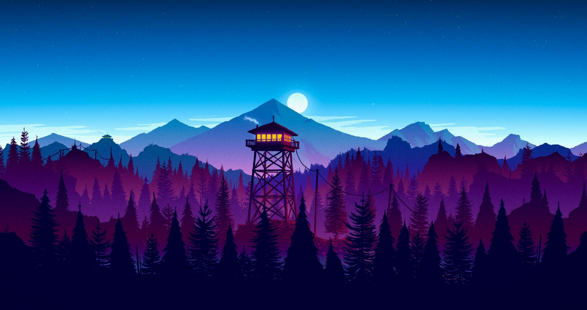
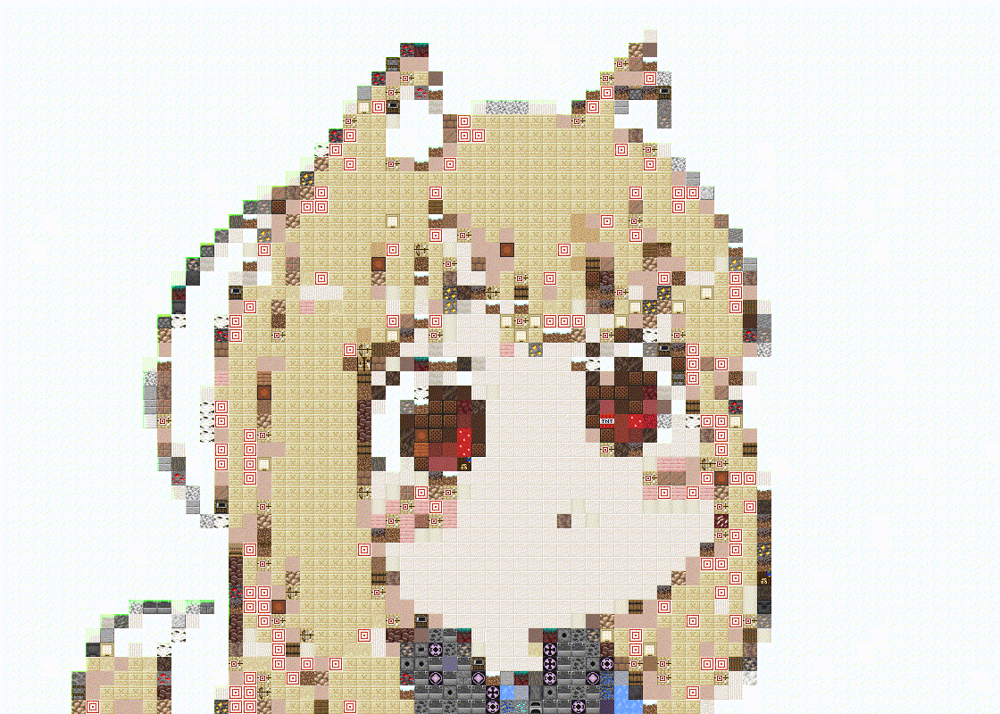

# McPixelizer
Convert image or video to image made of minecraft blocks

## How to use:
* Download repository
* Unpack blocks.zip in folder with main.py
* Download FFMpeg and add it to PATH
  
To find help with program type `py main.py --help`

## Supported formats
Images: .png and other formats support by **Python OpenCV**. Output always .png
Videos: .gif, .mp4. Output fromat can be changed with option to any other format supported by FFMpeg

## Examples

Processing videos:

